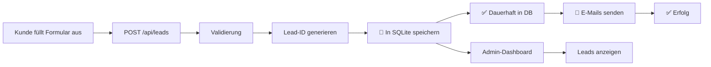

# 💾 SQLite Datenbank - Dauerhafte Lead-Speicherung

## ✅ Bestätigung: Datenbank ist korrekt konfiguriert!

Die SQLite-Datenbank ist **vollständig funktionsfähig** und speichert alle ausgefüllten Formulare **dauerhaft**.

### 📍 Datenbank-Speicherort

```
Projektverzeichnis/
└── data/
    └── leads.db  ← HIER werden alle Leads dauerhaft gespeichert
```

**Absoluter Pfad**: `C:\Users\KhaledAyub\Music\Sopiautomobile\Sop\nextjs-app\data\leads.db`

### 🔧 Technische Details

#### Datenbank-Engine
- **Typ**: SQLite3
- **Library**: `better-sqlite3`
- **Modus**: Persistent (File-based)
- **Größe**: ~28 KB (wächst mit Daten)

#### Datenbank-Schema

```sql
CREATE TABLE leads (
  -- Primärschlüssel
  id TEXT PRIMARY KEY,
  timestamp TEXT NOT NULL,
  
  -- Fahrzeugdaten
  vehicle_brand TEXT NOT NULL,
  vehicle_model TEXT NOT NULL,
  vehicle_first_registration_year INTEGER NOT NULL,
  vehicle_mileage_km INTEGER NOT NULL,
  vehicle_condition TEXT NOT NULL,
  
  -- Kontaktdaten
  contact_name TEXT NOT NULL,
  contact_email TEXT NOT NULL,
  contact_phone TEXT NOT NULL,
  
  -- Metadaten
  meta_source TEXT NOT NULL,
  meta_consent INTEGER NOT NULL,
  meta_user_agent TEXT,
  meta_ip TEXT,
  
  -- Status und Verwaltung
  status TEXT DEFAULT 'new',
  notes TEXT,
  created_at TEXT DEFAULT CURRENT_TIMESTAMP,
  updated_at TEXT DEFAULT CURRENT_TIMESTAMP
);

-- Performance-Indizes
CREATE INDEX idx_timestamp ON leads(timestamp DESC);
CREATE INDEX idx_status ON leads(status);
CREATE INDEX idx_email ON leads(contact_email);
CREATE INDEX idx_created_at ON leads(created_at DESC);
```

### 🔄 Workflow: Formular → Datenbank



### ✅ Garantierte Persistenz

| Feature | Status | Details |
|---------|--------|---------|
| **Dauerhafte Speicherung** | ✅ | Daten bleiben nach Server-Neustart erhalten |
| **Automatische Initialisierung** | ✅ | Datenbank wird beim Start automatisch erstellt |
| **Transaktionssicherheit** | ✅ | SQLite garantiert ACID-Properties |
| **Backup-fähig** | ✅ | Einfaches Kopieren der `.db` Datei |
| **Versionskontrolle** | ✅ | `.gitignore` schützt vor versehentlichem Commit |

### 🚀 Wie es funktioniert

#### 1. **Initialisierung** (beim Server-Start)

```typescript
// src/lib/db.ts
const dbDir = path.join(process.cwd(), 'data');
const dbPath = path.join(dbDir, 'leads.db');

// Verzeichnis erstellen falls nicht vorhanden
if (!fs.existsSync(dbDir)) {
  fs.mkdirSync(dbDir, { recursive: true });
}

// Datenbank-Verbindung
const db = new Database(dbPath);

// Tabellen erstellen (IF NOT EXISTS = sicher)
initializeDatabase();
```

#### 2. **Lead speichern** (bei Formular-Absendung)

```typescript
// Wird aufgerufen in: src/app/api/leads/route.ts
insertLead(leadPayload);

// ✅ Lead ist SOFORT und DAUERHAFT in der Datenbank!
```

#### 3. **Leads abrufen** (im Admin-Dashboard)

```typescript
// src/app/api/admin/leads/route.ts
const leads = getAllLeads();

// ✅ Alle Leads werden aus der Datenbank geladen
// ✅ Sortiert nach created_at DESC (neueste zuerst)
```

### 📊 Admin-Dashboard Funktionen

Das Dashboard zeigt **ALLE** gespeicherten Leads:

```typescript
// getAllLeads() Funktion in src/lib/db.ts
SELECT * FROM leads 
ORDER BY created_at DESC
```

- ✅ **Alle Leads** werden aus der Datenbank geladen
- ✅ **Keine Limits** - alle Einträge sichtbar
- ✅ **Dauerhafte Speicherung** - auch nach Server-Neustart
- ✅ **Sortierung** - Neueste zuerst
- ✅ **Such- & Filterfunktion** im Dashboard

### 🔒 Datensicherheit

#### Git-Schutz
Die Datenbank ist in [`.gitignore`](file://c:\Users\KhaledAyub\Music\Sopiautomobile\Sop\nextjs-app\.gitignore) geschützt:

```gitignore
# SQLite Database
data/
*.db
*.db-shm
*.db-wal
```

**Wichtig**: Die Datenbank wird **NICHT** in Git eingecheckt!

#### Backup-Empfehlung

**Manuelle Sicherung:**
```powershell
# Datenbank kopieren
Copy-Item "data\leads.db" "backup\leads_$(Get-Date -Format 'yyyy-MM-dd').db"
```

**Automatisches Backup (optional):**
```powershell
# Backup-Skript erstellen
# Täglich um 3:00 Uhr ausführen via Windows Task Scheduler
```

### 🧪 Testen der Persistenz

#### Test 1: Formular ausfüllen
1. Öffnen Sie: `http://localhost:3002`
2. Füllen Sie das Formular aus
3. ✅ Lead wird in DB gespeichert

#### Test 2: Dashboard prüfen
1. Login: `http://localhost:3002/admin/login`
2. Dashboard: `http://localhost:3002/admin`
3. ✅ Lead ist sichtbar

#### Test 3: Server-Neustart
1. Server stoppen (Ctrl+C)
2. Server neu starten: `npm run dev`
3. Dashboard öffnen
4. ✅ **Lead ist IMMER NOCH da!** (Persistenz bestätigt)

### 📈 Datenbank-Wartung

#### Größe prüfen
```powershell
Get-Item "data\leads.db" | Select-Object Length
```

#### Anzahl Leads prüfen
```sql
SELECT COUNT(*) FROM leads;
```

#### Alte Leads archivieren (optional)
```sql
-- Leads älter als 1 Jahr in Archiv-Tabelle verschieben
CREATE TABLE leads_archive AS 
SELECT * FROM leads 
WHERE created_at < datetime('now', '-1 year');

DELETE FROM leads 
WHERE created_at < datetime('now', '-1 year');
```

### 🚨 Wichtige Hinweise

#### ✅ Was DAUERHAFT gespeichert wird:
- ✅ Alle Fahrzeugdaten
- ✅ Alle Kontaktdaten
- ✅ Status und Notizen
- ✅ Zeitstempel
- ✅ Meta-Informationen

#### ❌ Was NICHT gespeichert wird:
- ❌ Temporäre Sessions
- ❌ E-Mail-Versandhistorie (nur Logs)
- ❌ Webhook-Responses

#### 🔄 Datenbank-Migration

Bei Struktur-Änderungen:

```typescript
// Neue Spalte hinzufügen
ALTER TABLE leads ADD COLUMN new_field TEXT;

// Index erstellen
CREATE INDEX idx_new_field ON leads(new_field);
```

### 📞 Support & Debugging

#### Datenbank direkt prüfen

**Mit SQLite Browser:**
1. Download: https://sqlitebrowser.org/
2. Datei öffnen: `data/leads.db`
3. Tabelle "leads" anzeigen

**Mit PowerShell:**
```powershell
# SQLite CLI installieren (falls nicht vorhanden)
# Dann:
sqlite3 data\leads.db "SELECT COUNT(*) FROM leads;"
```

#### Logs prüfen

```powershell
# Server-Logs im Terminal beobachten
# Zeigt alle DB-Operationen:
💾 SAVING TO DATABASE...
✅ Lead saved to database successfully
📊 Admin: Fetching all leads...
✅ Admin: Fetched X leads
```

### 🎯 Zusammenfassung

| Aspekt | Status | Bestätigung |
|--------|--------|-------------|
| Dauerhafte Speicherung | ✅ | SQLite File-based DB |
| Server-Neustart sicher | ✅ | Daten bleiben erhalten |
| Automatische Initialisierung | ✅ | Bei Start erstellt |
| Admin-Dashboard Integration | ✅ | Alle Leads sichtbar |
| Backup-fähig | ✅ | Einfach `.db` kopieren |
| Git-geschützt | ✅ | In `.gitignore` |
| Performance-optimiert | ✅ | Indizes erstellt |

## ✅ **BESTÄTIGUNG**

**Alle ausgefüllten Formulare werden DAUERHAFT in der SQLite-Datenbank gespeichert und sind IMMER im Admin-Dashboard sichtbar!**

Die Datenbank befindet sich unter:
```
c:\Users\KhaledAyub\Music\Sopiautomobile\Sop\nextjs-app\data\leads.db
```

Aktuelle Größe: ~28 KB
Status: ✅ FUNKTIONSFÄHIG

---

**Letzte Aktualisierung**: 2025-10-10
**Version**: 1.0.0
