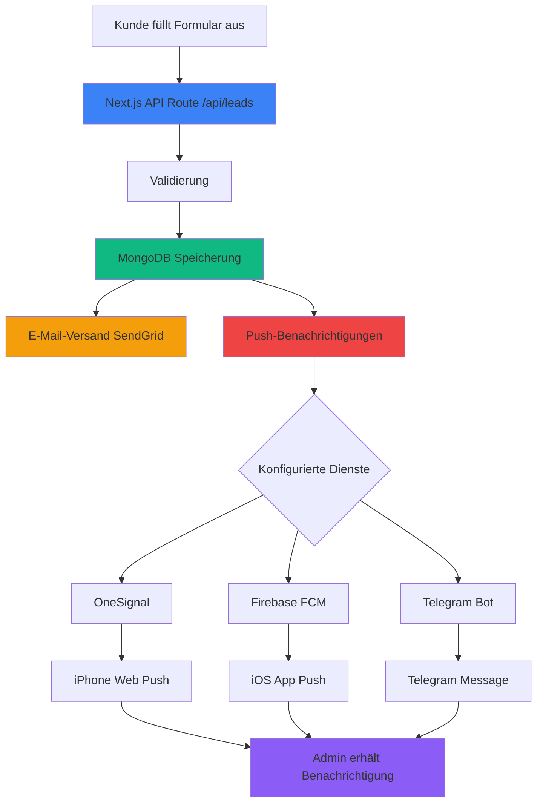
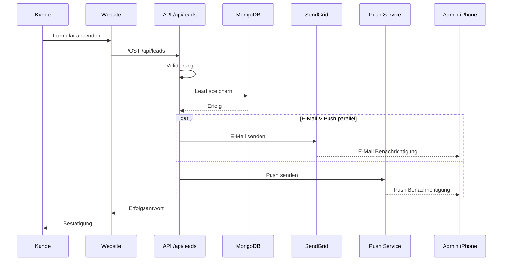

# 🏗️ Push-Benachrichtigungs-Architektur

## System-Übersicht



## Datenfluss



## Komponenten-Architektur

```
📁 nextjs-app/
│
├── 📁 src/
│   ├── 📁 app/
│   │   ├── 📁 api/
│   │   │   ├── 📁 leads/
│   │   │   │   └── 📄 route.ts          ← Lead-Verarbeitung + Push-Trigger
│   │   │   └── 📁 test-push/
│   │   │       └── 📄 route.ts          ← Test-API für Push
│   │   └── 📁 admin/
│   │       └── 📄 page.tsx              ← Admin Dashboard mit Test-Button
│   │
│   ├── 📁 lib/
│   │   ├── 📄 push-notification.ts      ← Push-Service (OneSignal, Firebase, Telegram)
│   │   ├── 📄 email-service.ts          ← E-Mail-Service (SendGrid)
│   │   └── 📄 db-mongodb.ts             ← MongoDB-Verbindung
│   │
│   └── 📁 components/
│       └── 📄 PushTestButton.tsx        ← React-Komponente für Tests
│
├── 📄 .env.local                         ← Konfiguration
├── 📄 PUSH_NOTIFICATIONS_SETUP.md        ← Vollständige Anleitung
├── 📄 PUSH_QUICKSTART.md                 ← 5-Minuten Setup
└── 📄 PUSH_ARCHITECTURE.md               ← Diese Datei
```

## API-Endpunkte

### 1. Lead API (mit Push-Integration)
```
POST /api/leads
```

**Request:**
```json
{
  "vehicle": {
    "brand": "BMW",
    "model": "320d",
    "firstRegistrationYear": 2018,
    "mileageKm": 120000,
    "condition": "gut"
  },
  "contact": {
    "name": "Max Mustermann",
    "email": "max@example.com",
    "phone": "+49 176 12345678"
  },
  "meta": {
    "source": "website",
    "consent": true
  }
}
```

**Response:**
```json
{
  "success": true,
  "message": "Ihre Anfrage wurde erfolgreich übermittelt.",
  "leadId": "abc-123-xyz",
  "estimatedResponseTime": "15-30 Minuten"
}
```

**Automatisch ausgelöst:**
- ✅ MongoDB-Speicherung
- ✅ E-Mail an Kunde
- ✅ E-Mail an Firma
- ✅ Push-Benachrichtigung (alle konfigurierten Dienste)

---

### 2. Test Push API
```
POST /api/test-push
```

**Request:** *(leer)*

**Response:**
```json
{
  "success": true,
  "message": "✅ Test-Push-Benachrichtigung wurde gesendet!",
  "timestamp": "2025-01-20T14:30:00.000Z"
}
```

**Health Check:**
```
GET /api/test-push
```

**Response:**
```json
{
  "status": "healthy",
  "service": "Push Notification Test API",
  "availableServices": {
    "oneSignal": true,
    "firebase": false,
    "telegram": true
  },
  "documentation": "/PUSH_NOTIFICATIONS_SETUP.md"
}
```

---

## Push-Service-Implementierung

### Datei: `src/lib/push-notification.ts`

**Hauptfunktion:**
```typescript
export async function sendPushNotifications(data: PushNotificationData): Promise<void>
```

**Unterstützte Dienste:**

| Dienst | Funktion | Status |
|--------|----------|--------|
| OneSignal | `sendOneSignalPush()` | ✅ Implementiert |
| Firebase | `sendFirebasePush()` | ✅ Implementiert |
| Telegram | `sendTelegramNotification()` | ✅ Implementiert |

**Fehlerbehandlung:**
- Alle Dienste laufen parallel (`Promise.allSettled`)
- Einzelne Fehler blockieren nicht andere Dienste
- Ausführliche Logging für Debugging
- Graceful Degradation (keine Dienste = keine Push, aber Lead wird gespeichert)

---

## Environment Variables

### Erforderlich für OneSignal:
```env
ONESIGNAL_APP_ID=abc123-def456
ONESIGNAL_API_KEY=OS-xyz...
ONESIGNAL_USER_ID=player-123
```

### Erforderlich für Firebase:
```env
FIREBASE_SERVER_KEY=AIza...
FIREBASE_DEVICE_TOKEN=device-token-123
```

### Erforderlich für Telegram:
```env
TELEGRAM_BOT_TOKEN=123456789:ABC...
TELEGRAM_CHAT_ID=123456789
```

### Optional (Public):
```env
NEXT_PUBLIC_ONESIGNAL_APP_ID=abc123-def456
```

---

## Sicherheitsaspekte

### 1. API-Sicherheit
- ✅ Input-Validierung (alle Felder)
- ✅ Honeypot-Spam-Schutz
- ✅ Rate-Limiting (Vercel automatisch)
- ✅ HTTPS-only (Vercel automatisch)

### 2. Datenschutz
- ✅ Keine sensiblen Daten in Push-Nachrichten
- ✅ Environment Variables verschlüsselt
- ✅ API-Keys niemals im Code
- ✅ MongoDB-Verbindung verschlüsselt

### 3. DSGVO-Compliance
- ✅ Consent-Checkbox erforderlich
- ✅ Datenminimierung in Benachrichtigungen
- ✅ EU-Server (OneSignal konfigurierbar)
- ✅ Recht auf Löschung (Admin-Panel)

---

## Performance-Optimierung

### Parallele Verarbeitung
```typescript
await Promise.allSettled([
  sendOneSignalPush(data),
  sendFirebasePush(data),
  sendTelegramNotification(data)
]);
```

**Vorteile:**
- 🚀 3x schneller als sequenziell
- 🛡️ Fehler isoliert
- ⚡ Nicht-blockierend

### Caching
- MongoDB-Verbindung wird wiederverwendet
- SendGrid-Client einmalig initialisiert

### Monitoring
- Ausführliche Logs in Vercel Functions
- Erfolgsraten in Console
- Fehler-Tracking

---

## Testing

### 1. Lokaler Test
```bash
npm run dev
# Browser: http://localhost:3000
# Admin: http://localhost:3000/admin
```

### 2. Test via curl
```bash
curl -X POST http://localhost:3000/api/test-push
```

### 3. Test via Admin-Panel
- Login: http://localhost:3000/admin/login
- Klick auf "🔔 Test Push-Benachrichtigung"

### 4. Produktions-Test
```bash
curl -X POST https://sopiautomobile.de/api/test-push
```

---

## Monitoring & Logs

### Vercel Dashboard
1. Projekt öffnen
2. **Functions** → Logs
3. Filter: `/api/leads` oder `/api/test-push`

### Log-Format
```
🚀 === LEAD API REQUEST STARTED ===
📋 PARSING REQUEST DATA...
✅ ALL VALIDATIONS PASSED
💾 SAVING TO DATABASE...
📧 EMAIL NOTIFICATIONS...
🔔 PUSH NOTIFICATIONS...
  🔔 === ONESIGNAL PUSH NOTIFICATION ===
  ✅ OneSignal notification sent successfully
  📱 === TELEGRAM NOTIFICATION ===
  ✅ Telegram notification sent successfully
✅ Push notifications: 2/3 successful
✅ === LEAD PROCESSING COMPLETED SUCCESSFULLY ===
```

---

## Troubleshooting-Guide

### Problem: Keine Push-Benachrichtigungen

**Schritt 1: Environment Variables prüfen**
```bash
GET /api/test-push
# Zeigt, welche Dienste konfiguriert sind
```

**Schritt 2: Logs überprüfen**
- Vercel Dashboard → Functions → Logs
- Suche nach: `PUSH NOTIFICATIONS`

**Schritt 3: Einzelne Dienste testen**
```bash
# OneSignal
curl -X POST https://onesignal.com/api/v1/notifications \
  -H "Authorization: Basic YOUR_KEY" \
  -d '{"app_id":"YOUR_APP",...}'

# Telegram
curl https://api.telegram.org/bot<TOKEN>/sendMessage \
  -d "chat_id=<ID>&text=Test"
```

### Problem: OneSignal funktioniert nicht

✅ **Checkliste:**
- [ ] Safari Push-Benachrichtigungen aktiviert?
- [ ] ONESIGNAL_APP_ID korrekt?
- [ ] ONESIGNAL_API_KEY korrekt?
- [ ] ONESIGNAL_USER_ID (Player ID) korrekt?
- [ ] OneSignal SDK auf Website integriert?

### Problem: Telegram funktioniert nicht

✅ **Checkliste:**
- [ ] Bot mit `/start` aktiviert?
- [ ] TELEGRAM_BOT_TOKEN korrekt?
- [ ] TELEGRAM_CHAT_ID korrekt?
- [ ] Test-Nachricht erfolgreich:
  ```bash
  curl https://api.telegram.org/bot<TOKEN>/getMe
  ```

---

## Erweiterungen & Roadmap

### Phase 1: ✅ Implementiert
- [x] OneSignal-Integration
- [x] Firebase-Integration
- [x] Telegram-Integration
- [x] Test-API
- [x] Admin-Panel-Integration
- [x] Dokumentation

### Phase 2: 🔜 Geplant
- [ ] WhatsApp Business API
- [ ] Slack-Integration
- [ ] E-Mail-Benachrichtigungen für Status-Änderungen
- [ ] SMS-Benachrichtigungen (Twilio)
- [ ] Desktop-Benachrichtigungen (Browser)

### Phase 3: 💡 Ideen
- [ ] Benachrichtigungs-Präferenzen im Admin-Panel
- [ ] Benachrichtigungs-Historie
- [ ] Automatische Eskalation bei nicht-Reaktion
- [ ] Integration mit CRM-Systemen

---

## Support & Kontakt

📧 Bei Fragen zur Implementierung
📖 Siehe auch: `PUSH_NOTIFICATIONS_SETUP.md`
🚀 Schnellstart: `PUSH_QUICKSTART.md`

---

**Version:** 1.0.0  
**Letzte Aktualisierung:** 2025-01-20  
**Autor:** Sopi Automobile Development Team
